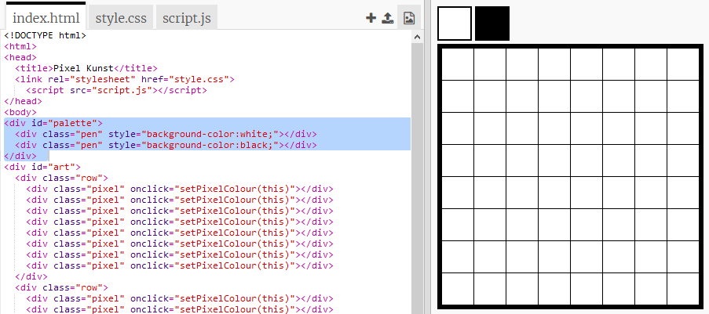

## Füge eine Farbpalette hinzu

Fandest du es ärgerlich, dass du die Farbe eines Pixels nicht wieder in Weiß ändern konntest, wenn du einen Fehler gemacht hast? Lasse uns das beheben, indem du eine Farbpalette erstellst, sodass du mit einem Klick zwischen den Stiftfarben wählen kannst.

+ Füge diesen Code unten in deiner `style.css` Datei hinzu, um einen Stift- (engl.: pen) Stil zu erstellen:

+ Erstelle nun eine Palette mit schwarzen und weißen Stiftfarben mit dem gerade erstellten Stift-Stil. Füge den folgenden Code zu deiner `index.html` unter dem `<body>` Tag hinzu:

`style=` ermöglicht es Dir, CSS-Code in deine HTML-Datei einzufügen, was hier praktisch ist.

Wir müssen Code hinzufügen, damit sich die Farbe des Stifts ändert, wenn eine der Farben in der Palette angeklickt wird.

+ Wechsel zu `script.js` und erstelle eine Variable namens `penColour` ("Stiftfarbe") ganz oben in der Datei. Setze den Wert der Variable auf `'black'` ("schwarz").

[[[generic-javascript-create-variable]]]

\--- hints \--- \--- hint \--- Füge den folgenden Code oben in der Datei hinzu:

 \--- /hint \--- \--- /hints \---

+ Erstelle unter der Variablen eine neue Funktion mit dem Namen `setPenColour` ("setzeStiftFarbe") mit einer Eingabe `pen`. Schaue dir die Funktion `setPixelColour` an, die du bereits erstellt hast, um Dir zu helfen.

[[[generic-javascript-create-a-function]]]

+ In der Funktion `setPenColour` fügst du Code hinzu, um die `penColour` Variable auf die `pen` Farbe zu setzen, die als Eingabe übergeben wurde.

Du musst die `penColour` Variable auch verwenden, wenn du die Farbe eines Pixels änderst.

+ Ändere die `setPixelColour` Funktion, um die `penColour` Variable zu verwenden anstatt `black`:
    
    

+ In der `index.html` Datei fügst du Code hinzu, um die `setPenColour` Funktion aufzurufen, wenn eine Farbe in der Palette angeklickt wird.

+ Teste aus, ob Du die Stiftfarbe zwischen Schwarz und Weiß wechseln kannst, um Pixel zu füllen oder zu löschen.