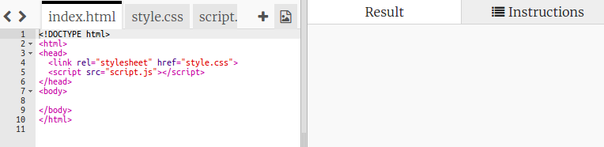

## Δημιούργησε ένα πλέγμα εικονοστοιχείων

Ας δημιουργήσουμε ένα πλέγμα εικονοστοιχείων που μπορείς να χρησιμοποιήσεις για να δημιουργήσεις pixel art.

Το πλέγμα θα μοιάζει με πίνακα. Οι πίνακες περιέχουν γραμμές και οι σειρές περιέχουν κελιά που αντιπροσωπεύουν τα εικονοστοιχεία.

+ Άνοιξε το [trinket εκκίνησης](http://jumpto.cc/web-pixel).

Το έργο πρέπει να μοιάζει έτσι:

Κατ΄αρχάς, ας γράψεις λίγο κώδικα ώστε να δημιουργήσεις έναν πίνακα με μαύρο φόντο και κατόπιν να τοποθετήσεις λευκά εικονοστοιχεία σ' αυτόν.

+ Πρόσθεσε αυτόν τον κώδικα στο `<body>` του `index.html` αρχείου για να δημιουργήσεις ένα `
`:

Το `
` είναι ένα αόρατο πλαίσιο στο οποίο μπορείς να δώσεις ένα **στυλ**. Αυτό το `
` έχει ένα ID με την τιμή `art`, το οποίο χρειάζεσαι προκειμένου να προσθέσεις στυλ στο πλαίσιο.

+ Τώρα πήγαινε στο αρχείο `style.css` και πρόσθεσε το στυλ πίνακα για το `
` με την ονομασία `art`.

Αυτό δημιουργεί έναν πίνακα με περίγραμμα και ορίζει τις αποστάσεις μέσα στο πλέγμα.

Δεν φαίνεται ακόμα πολύ ενδιαφέρον, γι' αυτό πρέπει να τοποθετήσεις γραμμές εικονοστοιχείων μέσα σ' αυτό.

+ Πήγαινε πίσω στο αρχείο `index.html ` και πρόσθεσε μια οριζόντια γραμμή με τρία εικονοστοιχεία ** μέσα ** στο πλαίσιο `art`. Προκειμένου να εξοικονομήσεις χρόνο, μπορείς να πληκτρολογήσεις την πρώτη σειρά και μετά με αντιγραφή και επικόλληση να δημιουργήσεις τις επόμενες.

Παρατήρησε πως εδώ χρησιμοποιείς την ιδιότητα **class** αντί για την ID προκειμένου να αποδώσεις στυλ στα divs. Αυτό γίνεται γιατί υπάρχουν πολλά απ' αυτά και έτσι η ιδιότητα class είναι πιο χρήσιμη.

+ Πήγαινε στο αρχείο `style.css` και πρόσθεσε τα παρακάτω στυλ για τις γραμμές και τα εικονοστοιχεία που υπάρχουν μέσα σε κάθε σειρά:

Τώρα τα εικονοστοιχεία θα ευθυγραμμιστούν στο πλέγμα με μαύρες γραμμές γύρω τους.

+ Στο αρχείο `index.html` πρόσθεσε δύο ακόμη τμήματα εικονοστοιχείων προκειμένου να δημιουργήσεις ένα πλέγμα 3x3. Μπορείς να χρησιμοποιήσεις ξανά την διαδικασία αντιγραφής - επικόλλησης για να γλιτώσεις χρόνο.

\--- hints \---

\--- hint \---

Εντόπισε την ετικέτα `
` με την ιδιότητα class που έχει τιμή `row` και αντίγραψέ την, συμπεριλαμβάνοντας και τις τρεις γραμμές με την τιμή ` pixel` καθώς και την ετικέτα κλεισίματος `
`.

Επικόλλησε αυτόν τον κώδικα αμέσως κάτω από το τμήμα που μόλις αντέγραψες για να δημιουργήσεις άλλη μια γραμμή. Επανάλαβε άλλη μια φορά ώστε να δημιουργήσεις τρεις γραμμές των τριών εικονοστοιχείων η καθεμία.

Μπορείς να ελέγξεις αν ο πίνακας σου φαίνεται σωστός εξετάζοντας την περιοχή αποτελεσμάτων στα δεξιά.

\--- hint \---

\--- hint \---

Έτσι πρέπει να φαίνεται ο κώδικάς σου:

\--- /hint \---

\--- /hints \---