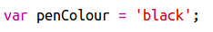

## Πρόσθεσε χρωματική παλέτα

Δεν βρήκες ενοχλητικό ότι δεν μπορούσες να ξανακάνεις λευκό ένα εικονοστοιχείο, σε περίπτωση λάθους; Διόρθωσέ το αυτό δημιουργώντας μια χρωματική παλέτα, ώστε να μπορείς να επιλέξεις κάποιο χρώμα με ένα κλικ.

+ Πρόσθεσε αυτόν τον κώδικα στο τέλος του αρχείου `style.css` για να δημιουργήσεις ένα στυλ για το μολύβι:

+ Τώρα κάνε μια παλέτα με άσπρα και μαύρα χρώματα μολυβιού χρησιμοποιώντας το στυλ μολυβιού που μόλις δημιούργησες. Πρόσθεσε τον παρακάτω κώδικα στο αρχείο `index.html` κάτω από την ετικέτα `<body>`:

Το `style=` σου επιτρέπει να προσθέσεις CSS κώδικα μέσα στο αρχείο HTML, το οποίο είναι βολικό εδώ.

Πρέπει να προσθέσεις κώδικα έτσι ώστε όταν πατηθεί ένα από τα χρώματα της παλέτας, το χρώμα του μολυβιού να αλλάζει.

+ Πήγαινε στο αρχείο `script.js` και δημιούργησε μια μεταβλητή με όνομα `penColour` στην αρχή του αρχείου. Όρισε την τιμή της μεταβλητής σε `'black'`.

[[[generic-javascript-create-variable]]]

\--- hints \--- \--- hint \--- Πρόσθεσε τον ακόλουθο κώδικα στην αρχή του αρχείου:

 \--- /hint \--- \--- /hints \---

+ Κάτω από τη μεταβλητή, δημιούργησε μια νέα συνάρτηση με όνομα `setPenColour` με όρισμα τη λέξη `pen`. Δες τη συνάρτηση `setPixelColour` που ήδη έχεις δημιουργήσει για να σε βοηθήσει.

[[[generic-javascript-create-a-function]]]

+ Μέσα στη συνάρτηση `setPenColour` πρόσθεσε κώδικα ώστε να ορίσεις τη μεταβλητή `penColour` με το χρώμα που θα περαστεί μέσω του ορίσματος `pen`.

Θα χρειαστεί επίσης να χρησιμοποιήσεις τη μεταβλητή `penColour` για ν' αλλάξεις το χρώμα ενός εικονοστοιχείου.

+ Άλλαξε τη συνάρτηση `setPixelColour` ώστε να κάνει χρήση της μεταβλητής `penColour` αντί της τιμής `black`:
    
    

+ Στο αρχείο `index.html`, πρόσθεσε κώδικα για να καλείς τη συνάρτηση `setPenColour` όταν πατηθεί κάποιο χρώμα στην παλέτα.

+ Δοκίμασε ότι μπορείς να εναλλάσσεις το χρώμα του μολυβιού ανάμεσα σε άσπρο - μαύρο για να χρωματίσεις ένα εικονοστοιχείο ή να το καθαρίσεις.