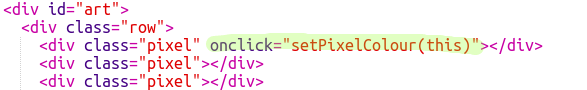

## Colorea los píxeles

Este proyecto usa tres lenguajes diferentes:

+ HTML se usa para organizar el contenido
+ CSS le dice al contenido cómo debe verse usando estilos
+ JavaScript es un lenguaje de programación que puedes usar para hacer que una página web responda cuando interactúas con ella

Agreguemos un código JavaScript para colorear un píxel automáticamente cuando haces clic en él.

Vamos a crear una **función**. Las funciones son bloques de código con nombre, que realizan una tarea particular. Podemos ** llamar ** una función por su nombre cuando queremos ejecutar el código que contiene.

+ Dentro del archivo ` script.js `, crea una función con el nombre ` setPixelColour `. La función `setPixelColour` debe tomar un `pixel` como **entrada** para que puede cambiar el color de ese píxel.

+ Agrega este código dentro de la función para establecer el color de fondo del píxel:

Observa que `backgroundColor` utiliza la ortografía estadounidense de 'color'.

Por el momento, este código no tiene ningún efecto.

+ Ve a `index.html` y agrega el código siguiente al primer píxel para que al hacer clic en este pixel, se llame a la función `setPixelColour`:

El ` this ` en los paréntesis es la entrada para la función ` setPixelColour `, que le permite saber a qué píxel darle el color - ` este` píxel!

+ Prueba tu código haciendo clic en el primer píxel. Deberá ponerse negro.

Solo has añadido el código ` onclick ` al ** first** píxel, por lo que hacer clic en los otros píxeles no hará nada todavía.