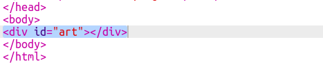

## Crea una cuadrícula de píxeles

Vamos a crear una cuadrícula de píxeles que puedes usar para crear un pixel art.

La cuadrícula se verá como una tabla. Las tablas contienen filas y las filas contienen celdas que representarán los píxeles.

+ Abre el [trinket de iniciación](http://jumpto.cc/web-pixel).

El proyecto deberá parecerse a esto:

Primero, escribe un código para crear una tabla con un fondo negro y luego poner píxeles blancos en ella.

+ Agrega este código en el `<body>` de tu archivo `index.html` para crear un `
`:

Un `
` es una caja invisible a la que le puedes dar un **estilo**. Este `
` tiene el ID `art`, que necesitas para que puedas añadir estilos a la caja.

+ Ahora ve a tu archivo `style.css` y agrega el estilo de tabla para el `
` llamado `art`.

Esto crea una tabla con una división y establece el espaciado interno de la cuadrícula.

Aun no se ve muy interesante, así que hay que poner filas de píxeles en su interior.

+ Vuelve a tu archivo `index.html` y agrega una fila de tres píxeles **dentro** de la caja `arte`. Si quieres ahorrar tiempo, puedes escribir la primera fila y luego copiarla y pegarla para crear las otras.

Ten en cuenta que aquí estás usando una **clase** en lugar de un ID para dar estilo a los divs. Esto se debe a que habrá muchos de ellos, por lo que una clase es más útil.

+ Cambia al archivo `style.css` y agrega los siguientes estilos para las filas y los píxeles dentro de cada fila:

Ahora tus píxeles se alinearán en una cuadrícula con líneas negras a su alrededor.

+ En tu archivo `index.html`, agrega otras dos secciones de píxeles para crear una cuadrícula de 3 × 3. Puedes usar copiar y pegar nuevamente para ahorrar tiempo.

--- hints ---

--- hint ---

Encuentra la etiqueta `
` con la clase `fila` y cópiala, incluyendo las tres filas llamadas `pixel` que están dentro de ella, incluyendo la etiqueta de coincidencia`
`.

Pega este código inmediatamente debajo de la sección que acabas de copiar para crear otra fila. Repite una vez más para tener tres filas de tres píxeles cada una.

Puedes comprobar si tu tabla se ve bien mirando el área de resultados de la derecha.

--- /hint ---

--- hint ---

Así es como debería verse tu código:

--- /hint ---

--- /hints ---