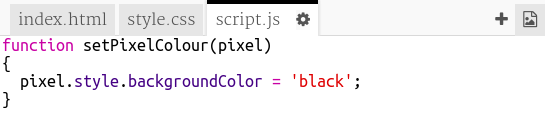

## પિક્સેલ્સ ને રંગ કરો

આ પ્રોજેક્ટ ત્રણ જુદી જુદી ભાષાઓનો ઉપયોગ કરે છે:

+ એચટીએમએલનો(HTML) ઉપયોગ તમારી સામગ્રીને ગોઠવવા માટે થાય છે
+ સી.એસ.એસ. (CSS) સામગ્રીને શૈલીઓ સાથે કેવા દેખાવા જોઈએ તે કહે છે
+ જાવાસ્ક્રિપ્ટ (Javascript) એ એક પ્રોગ્રામિંગ લેંગ્વેજ છે જેનો ઉપયોગ તમે જ્યારે વેબપૃષ્ઠને તેની સાથે સંપર્ક કરો છો ત્યારે પ્રતિસાદ આપવા માટે કરી શકો છો

ચાલો કેટલાક જાવાસ્ક્રિપ્ટ કોડ ઉમેરીએ જેના ઉપયોગ થી જ્યારે તમે પિક્સેલ પર ક્લિક કરો ત્યારે તેમાં આપમેળે રંગ ભરાઇ જાય.

આપણે **ફંક્શન (function)** બનાવીશું. વિધેયો નામવાળી કોડ ની બ્લોક્સ છે જે કોઈ વિશિષ્ટ કાર્ય કરે છે. જ્યારે આપણે તેમાં સમાયેલા કોડને ચલાવવા માંગતા હોય ત્યારે આપણે ફંક્શન ના નામ દ્વારા ** કોલ(call)</ 0> કરી શકીએ છીએ.
 

+ `script.js` ફાઇલની અંદર, `સેટ પિક્સેલ કલર` નામ સાથે એક કાર્ય બનાવો. `setPixelColour` ફંક્શનમાં `pixel` ને **input** તરીકે લેવાની જરૂર છે જેથી તે તે પિક્સેલનો રંગ બદલી શકે.

+ પિક્સેલનો બેકગ્રાઉન્ડ રંગ સેટ કરવા માટે ફંક્શનની અંદર આ કોડ ઉમેરો:

નોંધ લો કે `બેકગ્રાઉન્ડ કલર` 'colour' ના અમેરિકન જોડણી (color) નો ઉપયોગ કરે છે.

અત્યારે આ કોડની કોઈ અસર નથી.

+ `index.html` પર જાઓ અને પ્રથમ પિક્સેલમાં નીચેનો કોડ ઉમેરો જેથી જ્યારે તમે આ પિક્સેલ પર ક્લિક કરો, `setPixelColour` ફંક્શન ને બોલાવવામાં આવે છે:

કૌંસમાંનો `this` એ `setPixelColour` ફંક્શન માટેનું ઇનપુટ છે, જે તમને તે જાણવા દે છે કે કયા પિક્સેલ માટે રંગ સેટ કરવો — `this` પિક્સેલ!

+ પ્રથમ પિક્સેલ પર ક્લિક કરીને તમારા કોડની પરીક્ષણ કરો. તે કાળો થવો જોઈએ.

તમે ફક્ત **first** પિક્સેલમાં `onclick` કોડ ઉમેર્યો છે, તેથી બીજા પિક્સેલ્સ પર ક્લિક કરવાથી હજી કંઈ થશે નહીં.