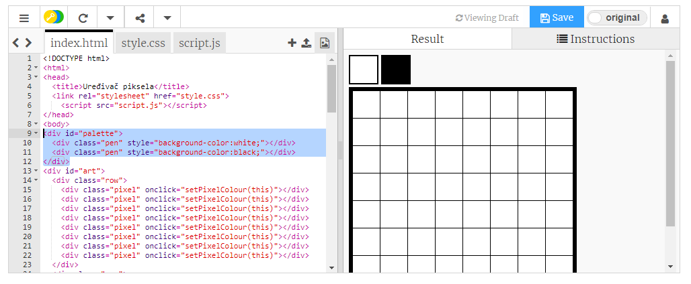

## Dodajte paletu boja

Jeste li ga smatrali neugodno da niste mogli promijeniti boju piksela u bijelu boju ako ste pogriješili? Riješimo to stvaranjem palete boja tako da možete odabrati između boja olovke jednim klikom.

+ Dodajte ovaj kôd pri dnu svoje `style.css` datoteke kako biste stvorili stil olovke:

+ Sada stvorite paletu s crnim i bijelim bojama olovke koristeći stil olovke koji ste upravo stvorili. Dodajte sljedeći kôd na svoj `index.html` ispod oznake `<body>`:

`style =` omogućuje dodavanje CSS koda unutar vaše HTML datoteke, što je ovdje prikladno.

Moramo dodati kôd tako da kada se klikne jedna od boja u paleti, boja olovke se mijenja.

+ Prijeđite na `script.js` i izradite varijablu nazvanu `penColour` na samom vrhu datoteke. Postavite vrijednost varijable na `'crno'`.

[[[generic-javascript-create-variable]]]

\--- savjeti \--- \--- savjet \--- Dodajte sljedeći kod pri vrhu datoteke:

 \--- /hint \--- \--- /hints \---

+ Ispod varijable stvorite novu funkciju nazvanu `setPenColour` s unosom `olovke`. Pogledajte funkciju `setPixelColour` koju ste već stvorili kako bi vam pomogli.

[[[generic-javascript-create-a-function]]]

+ Unutar `setPenColour` funkcije, dodajte kod za postavljanje `penColour` varijabla na `olovku` koja se daje kao ulaz.

Također ćete morati koristiti varijablu `penColour` kada promijenite boju piksela.

+ Promijenite `setPixelColour` funkciju da biste koristili `penColour` varijablu umjesto `crno`:
    
    

+ U `index.html` datoteku dodajte neki kôd da biste nazvali `setPenColour` funkciju kada se klikne boja u paleti.

+ Ispitajte da možete promijeniti boju olovke između crno-bijelog da biste ispunili ili izbrisali piksele.