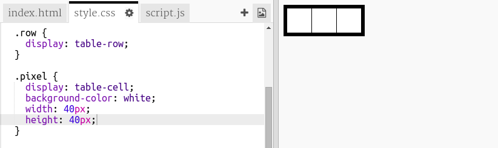

## ピクセルグリッドを作成する

ピクセルアートの作成に使用できるピクセルのグリッドを作成しましょう。

グリッドはテーブルのように見えます。表には行が含まれ、行にはピクセルを表すセルが含まれます。

+ [スターター小物](http://jumpto.cc/web-pixel)開きます。

プロジェクトはこのようになります。

まず、黒い背景を持つテーブルを作成し、白いピクセルをそのテーブルに入れるコードを記述しましょう。

+ あなたの `index.html` ファイルの `<body>` にこのコードを追加して `
`：

`
` は不可視のボックスで、 **スタイルを与えることができます**。 この `
` にはID `art`があります。これにより、ボックスにスタイルを追加できるようになります。

+ 今度は `style.css` ファイルに行き、 `
` という `アート`のテーブルスタイリングを追加してください。

これにより、境界線を持つテーブルが作成され、グリッド内の間隔が設定されます。

それはまだ非常に面白そうに見えないので、内部にピクセルの行を配置する必要があります。

+ `index.html` ファイルに戻って、3つのピクセル **行を** の `アート` ボックスに追加します。 時間を節約したい場合は、最初の行を入力してからコピーして貼り付けて、他の行を作成することができます。

ここでは、IDの代わりに **クラス** を使用してdivをスタイルすることに注目してください。これはたくさんありそうなので、クラスがもっと便利です。

+ `style.css` ファイルに切り替えて、各行内の行とピクセルに次のスタイルを追加します。

これで、ピクセルがグリッド内に黒線で表示されます。

+ `index.html` ファイルに、別の2つのピクセルセクションを追加して、3×3ピクセルグリッドを作成します。もう一度コピー＆ペーストして時間を節約することができます。

\---ヒント\--- \---ヒント\--- クラス `行` の `
` タグを見つけて、その中にある `ピクセル` とラベル付けされた3つの行を含めてコピーします。 `
` タグと一致する。

別の行を作成するためにコピーしたセクションのすぐ下にこのコードを貼り付けます。もう一度繰り返すと、それぞれ3ピクセルの3行が表示されます。

右側の結果領域を見ることで、テーブルが正しいかどうかを確認することができます。 \--- / hint \--- \---ヒント\--- ここであなたのコードがどのように見えるかを示します：

 \--- /hint \--- \--- /hints \---