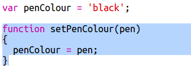

## カラーパレットを追加する

あなたが間違いを犯した場合、ピクセルの色を白に戻すことができなかったのは面倒ですか？ クリックでペンの色を選択できるように、カラーパレットを作成して修正しましょう。

+ このコードを `style.css` ファイルの末尾に追加して、ペンスタイルを作成します。

+ 今作成したペンスタイルを使用して、黒と白のペンカラーでパレットを作成します。 `<body>` タグの下のindex.html</code> 次のコードを追加します `</li>
</ul>

<code>style =` はHTMLファイルの中にCSSコードを追加することを可能にします。
 
    パレットの色の1つをクリックすると、ペンの色が変わるようにコードを追加する必要があります。
    
    + `script.js` 切り替えて、ファイルの一番上に `penColour` という変数を作成します。変数の値を `'黒'`設定します。
    
    [[[generic-javascript-create-variable]]]
    
    \---ヒント\--- \---ヒント\--- \--- ファイルの先頭に次のコードを追加します。
    
     \--- /hint \--- \--- /hints \---
    
    + 変数の下に、 `setPenColour` という新しい関数を作成し、 `ペン`入力を加えます。すでに作成した関数 `setPixelColour` を見てください。
    
    [[[generic-javascript-create-a-function]]]
    
    + `setPenColour` 関数の中で、 `penColour` 変数を入力として提供された `pen` 色に設定するコードを追加します。
    
    
    
    You'll also need to use the `penColour` variable when you change the colour of a pixel.
    
    + `setPixelColour` 関数を変更して、 `代わりに <code>penColour` 変数を使用する</code>：
        
        
    
    + `index.html` ファイルで、パレットの色をクリックしたときに `setPenColour` 関数を呼び出すコードを追加します。
    
    
    
    + ペンの色を黒と白の間で切り替えて、ピクセルを塗りつぶしたり削除したりできることをテストします。