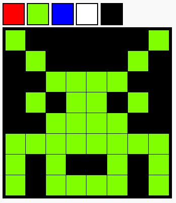

## ಪರಿಚಯ

ಪಿಕ್ಸೆಲ್ ಆರ್ಟ್ ಎಡಿಟರ್ ರಚಿಸಿ. ಬಳಸುವುದರ ಜೊತೆಗೆ HTML ಮತ್ತು CSS, ಹೇಗೆ ಬಳಸುವುದು ಎಂದು ನೀವು ಕಲಿಯುವಿರಿ JavaScript ನಿಮ್ಮ ಯೋಜನೆಗೆ ಪಾರಸ್ಪರಿಕತೆಯನ್ನು ಸೇರಿಸಲು.

### ನೀವು ಏನು ಮಾಡುತ್ತೀರಿ

ಕೆಳಗಿನ ಯೋಜನೆಯನ್ನು ಪ್ರಯತ್ನಿಸಿ. ಪ್ಯಾಲೆಟ್ನಿಂದ ಬಣ್ಣವನ್ನು ಕ್ಲಿಕ್ ಮಾಡಿ, ನಂತರ ಅದರ ಬಣ್ಣವನ್ನು ಬದಲಾಯಿಸಲು ಪಿಕ್ಸೆಲ್ ಕ್ಲಿಕ್ ಮಾಡಿ.

  <iframe src="https://trinket.io/embed/html/0e102a306b?outputOnly=true&start=result" width="600" height="450" frameborder="0" marginwidth="0" marginheight="0" allowfullscreen>
  </iframe>
  

### ನೀವು ಏನು ಕಲಿಯುವಿರಿ

ಈ ಯೋಜನೆಯು ಈ ಕೆಳಗಿನ ಎಳೆಗಳಿಂದ ಅಂಶಗಳನ್ನು ಒಳಗೊಂಡಿದೆ [Raspberry Pi Digital Making Curriculum](http://rpf.io/curriculum){:target="_blank"}:

+ [ಮೂಲ ವಿನ್ಯಾಸ 2D ಮತ್ತು 3D assets](https://www.raspberrypi.org/curriculum/design/creator){:target="_blank"}.

+ [ಸರಳ ಕಾರ್ಯಕ್ರಮಗಳನ್ನು ರಚಿಸಲು ಮೂಲ ಪ್ರೋಗ್ರಾಮಿಂಗ್ ರಚನೆಗಳನ್ನು ಬಳಸಿ](https://www.raspberrypi.org/curriculum/programming/creator){:target="_blank"}

### ಶಿಕ್ಷಣತಜ್ಞರಿಗೆ ಹೆಚ್ಚುವರಿ ಮಾಹಿತಿ

ನೀವು ಈ ಯೋಜನೆಯನ್ನು ಮುದ್ರಿಸಬೇಕಾದರೆ, ದಯವಿಟ್ಟು ಬಳಸಿ [ಪ್ರಿಂಟ್ರ್ -ಫ್ರೆಂಡ್ಲಿ ವರ್ಷನ್](https://projects.raspberrypi.org/kn-IN/projects/pixel-art/print){:target="_blank"}.

ಲಿಂಕ್ ಬಳಸಿ ಫೂಟರ್ ಪ್ರವೇಶಿಸಲು GitHub repository ಈ ಯೋಜನೆಗಾಗಿ, ಇದರಲ್ಲಿ ಎಲ್ಲಾ ಸಂಪನ್ಮೂಲಗಳನ್ನು ಒಳಗೊಂಡಿದೆ (ಉದಾಹರಣೆ ಮುಗಿದ ಯೋಜನೆ ಸೇರಿದಂತೆ) ‘kn-IN/resources’ ಫೋಲ್ಡರ್.