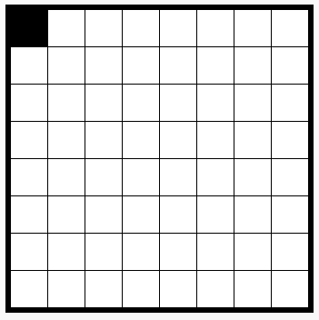

## ಪಿಕ್ಸೆಲ್‌ಗಳನ್ನು ಬಣ್ಣ ಮಾಡಿ

ಈ ಯೋಜನೆಯು ಮೂರು ವಿಭಿನ್ನ ಭಾಷೆಗಳನ್ನು ಬಳಸುತ್ತದೆ:

+ HTML ನಿಮ್ಮ ವಿಷಯವನ್ನು ಸಂಘಟಿಸಲು ಬಳಸಲಾಗುತ್ತದೆ
+ CSS ಶೈಲಿಗಳೊಂದಿಗೆ ಹೇಗಿರಬೇಕೆಂದು ವಿಷಯವನ್ನು ಹೇಳುತ್ತದೆ
+ JavaScript ಮಾಡಲು ನೀವು ಬಳಸಬಹುದಾದ ಪ್ರೋಗ್ರಾಮಿಂಗ್ ಭಾಷೆ webpage ನೀವು ಅದರೊಂದಿಗೆ ಸಂವಹನ ನಡೆಸಿದಾಗ ಪ್ರತಿಕ್ರಿಯಿಸಿ

ಕೆಲವು ಸೇರಿಸೋಣ JavaScript code ನೀವು ಕ್ಲಿಕ್ ಮಾಡಿದಾಗ ಪಿಕ್ಸೆಲ್‌ನಲ್ಲಿ ಸ್ವಯಂಚಾಲಿತವಾಗಿ ಬಣ್ಣ ಮಾಡಲು.

ನಾವು ರಚಿಸುತ್ತೇವೆ **function**. Functions ನಿರ್ದಿಷ್ಟ ಕಾರ್ಯವನ್ನು ನಿರ್ವಹಿಸುವ ಕೋಡ್ ಬ್ಲಾಕ್ಗಳನ್ನು ಹೆಸರಿಸಲಾಗಿದೆ. ನಾವು ಮಾಡಬಲ್ಲೆವು **call** function ನಾವು ಹೊಂದಿರುವ ಕೋಡ್ ಅನ್ನು ಚಲಾಯಿಸಲು ನಾವು ಬಯಸಿದಾಗ ಅದರ ಹೆಸರಿನಿಂದ.

+ ಒಳಗೆ `script.js` file, ರಚಿಸಿ function ಹೆಸರಿನೊಂದಿಗೆ `setPixelColour`. `setPixelColour` function ತೆಗೆದುಕೊಳ್ಳುವ ಅಗತ್ಯವಿದೆ `pixel` ಒಂದು **input** ಆದ್ದರಿಂದ ಅದು ಆ ಪಿಕ್ಸೆಲ್‌ನ ಬಣ್ಣವನ್ನು ಬದಲಾಯಿಸಬಹುದು.

+ ಒಳಗೆ ಈ ಕೋಡ್ ಸೇರಿಸಿ function ಪಿಕ್ಸೆಲ್‌ನ ಹಿನ್ನೆಲೆ ಬಣ್ಣವನ್ನು ಹೊಂದಿಸಲು:

ಅದನ್ನು ಗಮನಿಸು `backgroundColor` ಅಮೇರಿಕನ್ ಕಾಗುಣಿತವನ್ನು ಬಳಸುತ್ತದೆ 'colour'.

ಈ ಸಮಯದಲ್ಲಿ ಈ ಕೋಡ್ ಯಾವುದೇ ಪರಿಣಾಮ ಬೀರುವುದಿಲ್ಲ.

+ ಹೋಗಿ `index.html` ಮತ್ತು ಈ ಕೆಳಗಿನ ಕೋಡ್ ಅನ್ನು ಮೊದಲ ಪಿಕ್ಸೆಲ್‌ಗೆ ಸೇರಿಸಿ ಇದರಿಂದ ನೀವು ಈ ಪಿಕ್ಸೆಲ್ ಅನ್ನು ಕ್ಲಿಕ್ ಮಾಡಿದಾಗ `setPixelColour` function ಕರೆಯಲಾಗುತ್ತದೆ:

`this` ಆವರಣಗಳಲ್ಲಿ ಇನ್ಪುಟ್ ಗಾಗಿ `setPixelColour` function, ಇದು ಯಾವ ಪಿಕ್ಸೆಲ್‌ಗೆ ಬಣ್ಣವನ್ನು ಹೊಂದಿಸಬೇಕೆಂದು ತಿಳಿಯಲು ಅನುವು ಮಾಡಿಕೊಡುತ್ತದೆ — `this` ಪಿಕ್ಸೆಲ್!

+ ಮೊದಲ ಪಿಕ್ಸೆಲ್ ಕ್ಲಿಕ್ ಮಾಡುವ ಮೂಲಕ ನಿಮ್ಮ ಕೋಡ್ ಅನ್ನು ಪರೀಕ್ಷಿಸಿ. ಅದು ಕಪ್ಪು ಬಣ್ಣಕ್ಕೆ ತಿರುಗಬೇಕು.

ನೀವು ಮಾತ್ರ ಸೇರಿಸಿದ್ದೀರಿ `onclick` ಗೆ ಕೋಡ್ **first** ಪಿಕ್ಸೆಲ್, ಆದ್ದರಿಂದ ಇತರ ಪಿಕ್ಸೆಲ್‌ಗಳ ಮೇಲೆ ಕ್ಲಿಕ್ ಮಾಡುವುದರಿಂದ ಇನ್ನೂ ಏನೂ ಆಗುವುದಿಲ್ಲ.