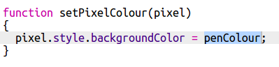
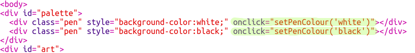

## ಬಣ್ಣದ ಪ್ಯಾಲೆಟ್ ಸೇರಿಸಿ

ನೀವು ತಪ್ಪು ಮಾಡಿದರೆ ಪಿಕ್ಸೆಲ್‌ನ ಬಣ್ಣವನ್ನು ಮತ್ತೆ ಬಿಳಿ ಬಣ್ಣಕ್ಕೆ ಬದಲಾಯಿಸಲು ಸಾಧ್ಯವಿಲ್ಲ ಎಂದು ನಿಮಗೆ ಕಿರಿಕಿರಿ ಕಂಡುಬಂದಿದೆಯೇ? ಬಣ್ಣದ ಪ್ಯಾಲೆಟ್ ಅನ್ನು ರಚಿಸುವ ಮೂಲಕ ಅದನ್ನು ಸರಿಪಡಿಸೋಣ ಇದರಿಂದ ನೀವು ಪೆನ್ ಬಣ್ಣಗಳ ನಡುವೆ ಕ್ಲಿಕ್ ಮೂಲಕ ಆಯ್ಕೆ ಮಾಡಬಹುದು.

+ ನಿಮ್ಮ ಕೆಳಭಾಗದಲ್ಲಿ ಈ ಕೋಡ್ ಸೇರಿಸಿ `style.css` ಪೆನ್ ಶೈಲಿಯನ್ನು ರಚಿಸಲು ಫೈಲ್:

+ ಈಗ ನೀವು ರಚಿಸಿದ ಪೆನ್ ಶೈಲಿಯನ್ನು ಬಳಸಿಕೊಂಡು ಕಪ್ಪು ಮತ್ತು ಬಿಳಿ ಪೆನ್ ಬಣ್ಣಗಳೊಂದಿಗೆ ಪ್ಯಾಲೆಟ್ ರಚಿಸಿ. ನಿಮ್ಮ ಕೆಳಗಿನ ಕೋಡ್ ಅನ್ನು ಸೇರಿಸಿ`index.html` ಕೆಳಗೆ `<body>` tag:

`style=` ಸೇರಿಸಲು ನಿಮಗೆ ಅನುಮತಿಸುತ್ತದೆ CSS ನಿಮ್ಮ ಒಳಗೆ ಕೋಡ್ HTML ಫೈಲ್, ಇದು ಇಲ್ಲಿ ಅನುಕೂಲಕರವಾಗಿದೆ.

ನಾವು ಕೋಡ್ ಅನ್ನು ಸೇರಿಸುವ ಅಗತ್ಯವಿರುತ್ತದೆ ಆದ್ದರಿಂದ ಪ್ಯಾಲೆಟ್ನಲ್ಲಿನ ಬಣ್ಣಗಳಲ್ಲಿ ಒಂದನ್ನು ಕ್ಲಿಕ್ ಮಾಡಿದಾಗ, ಪೆನ್ನ ಬಣ್ಣವು ಬದಲಾಗುತ್ತದೆ.

+ ಬದಲಾಯಿಸಲು `script.js` ಮತ್ತು ಎಂಬ ವೇರಿಯೇಬಲ್ ಅನ್ನು ರಚಿಸಿ `penColour` ಅತ್ಯಂತ ಮೇಲ್ಭಾಗದಲ್ಲಿ ಫೈಲ್. ವೇರಿಯೇಬಲ್ ಮೌಲ್ಯವನ್ನು ಇದಕ್ಕೆ ಹೊಂದಿಸಿ `'black'`.

[[[generic-javascript-create-variable]]]

\--- hints \---

\--- hint \---

ಫೈಲ್‌ನ ಮೇಲ್ಭಾಗದಲ್ಲಿ ಈ ಕೆಳಗಿನ ಕೋಡ್ ಸೇರಿಸಿ:

\--- /hint \---

\--- /hints \---

+ ವೇರಿಯಬಲ್ ಕೆಳಗೆ, ಹೊಸದನ್ನು ರಚಿಸಿ function ಕರೆಯಲಾಗುತ್ತದೆ `setPenColour` ಇನ್ಪುಟ್ನೊಂದಿಗೆ `pen`. ಅತ್ತ ನೋಡು function `setPixelColour` ನಿಮಗೆ ಸಹಾಯ ಮಾಡಲು ನೀವು ಈಗಾಗಲೇ ರಚಿಸಿದ್ದೀರಿ.

[[[generic-javascript-create-a-function]]]

+ ಒಳಗೆ `setPenColour` function, ಹೊಂದಿಸಲು ಕೋಡ್ ಸೇರಿಸಿ `penColour` ವೇರಿಯಬಲ್ `pen` ಬಣ್ಣವನ್ನು ಇನ್ಪುಟ್ ಆಗಿ ಒದಗಿಸಲಾಗಿದೆ.

ನೀವು ಸಹ ಬಳಸಬೇಕಾಗುತ್ತದೆ `penColour` ನೀವು ಪಿಕ್ಸೆಲ್ ಬಣ್ಣವನ್ನು ಬದಲಾಯಿಸಿದಾಗ ವೇರಿಯಬಲ್.

+ ಬದಲಾಯಿಸಲು `setPixelColour` function ಬಳಸಲು `penColour` ಬದಲಿಗೆ ವೇರಿಯಬಲ್ `black`:
    
    

+ ಇದರಲ್ಲಿ `index.html` file, ಕರೆ ಮಾಡಲು ಕೆಲವು ಕೋಡ್ ಸೇರಿಸಿ `setPenColour` function ಪ್ಯಾಲೆಟ್ನಲ್ಲಿ ಬಣ್ಣವನ್ನು ಕ್ಲಿಕ್ ಮಾಡಿದಾಗ.

+ ಪಿಕ್ಸೆಲ್‌ಗಳನ್ನು ತುಂಬಲು ಅಥವಾ ಅಳಿಸಲು ನೀವು ಪೆನ್ ಬಣ್ಣವನ್ನು ಕಪ್ಪು ಮತ್ತು ಬಿಳಿ ನಡುವೆ ಬದಲಾಯಿಸಬಹುದು ಎಂದು ಪರೀಕ್ಷಿಸಿ.