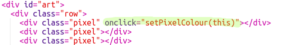

## 픽셀에 색상 입히기

이 프로젝트는 세 가지 다른 언어를 사용합니다.

+ 내용을 구성하기 위해 HTML 사용
+ 스타일을 어떻게 보여줄지 구성하는 CSS 사용
+ 웹페이지 상호 작용을 구현하기 위한 JavaScript 사용

이제 JavaScript 코드를 추가하여 클릭할 때 자동으로 색상을 지정하는 코드를 추가해 보겠습니다.

우리는 **함수**를 제작할 것입니다. 함수는 특정 작업을 수행하는 코드 블록입니다. 해당 블록을 실행하고자 할 때 우리는 함수를 **호출**할 수 있습니다.

+ `script.js` 파일에 들어가서, `setPixelColour` 함수를 제작하십시오. `setPixelColour` 함수는 `pixel`을 **입력**으로 받아 픽셀의 색깔을 바꿀 수 있도록 설정해 주는 함수입니다.

+ 아래 코드를 함수 안에 추가하여 픽셀의 배경색을 설정하세요.

`backgroundColor`는 'colour'라는 미국식 철자를 사용합니다.

아직 이 코드는 아무런 효과가 없습니다.

+ `index.html`로 이동해 아래 코드를 첫 번째 픽셀에 추가하여 픽셀을 클릭할 때 `setPixelColour` 함수가 호출되도록 합니다.

괄호 안의 `this`는 `setPixelColour` 함수의 입력을 의미하고 어떤 픽셀에 색상 정보를 줘야 할지 알려줍니다. - `this` 픽셀!

+ 첫 번째 픽셀을 클릭하여 코드를 테스트하십시오. 검은 색으로 변하는 것을 확인할 수 있습니다.

아직 `onclick` 코드를 **첫 번째** 픽셀밖에 적용하지 못했습니다. 다른 픽셀을 클릭했을 때에는 아무런 변화가 없을 것입니다.