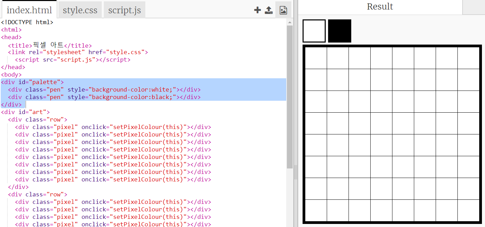
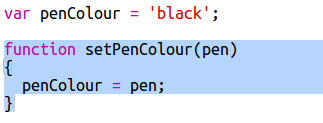
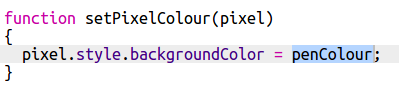

## 색깔 팔레트 추가

실수로 검은색을 칠해 버렸을 때 다시 흰색으로 바꾸지 못한다는 것을 알고 계셨나요? 이제 색상 팔레트를 만들어 그 문제를 해결해 봅시다!

+ 아래 코드를 `style.css` 파일에 추가해 펜 스타일을 만들어 봅시다.

+ 이제 검은색과 회색 펜 색상 팔레트를 제작하였습니다. 아래 코드를 `index.html` 내 `<body>` 태그 안에 넣어 주십시오.

`style=`은 CSS 코드를 HTML 파일에 넣을 수 있도록 해 줍니다. 편리하게 사용할 수 있는 기능이니 참고하시기 바랍니다.

팔레트의 색깔 중 하나를 클릭하면 펜의 색상이 변경되도록 코드를 추가할 것입니다.

+ `script.js` 파일에서 `penColour` 변수를 코드의 제일 위에 만드세요. 그리고 변수의 값을 `'black'`으로 설정하세요.

[[[generic-javascript-create-variable]]]

\--- hints \--- \--- hint \--- 아래 코드를 파일 가장 위에 삽입하세요.

 \--- /hint \--- \--- /hints \---

+ Below the variable, create a new function called `setPenColour` with an input of `pen`. Look at the function `setPixelColour` that you already created to help you.

[[[generic-javascript-create-a-function]]]

+ Inside the `setPenColour` function, add code to set the `penColour` variable to the `pen` colour provided as the input.

You'll also need use the `penColour` variable when you change the colour of a pixel.

+ Change the `setPixelColour` function to use the `penColour` variable instead of `black`:
    
    

+ In the `index.html` file, add some code to call the `setPenColour` function when a colour in the palette is clicked.

+ Test that you can switch the pen colour between black and white to fill in or delete pixels.