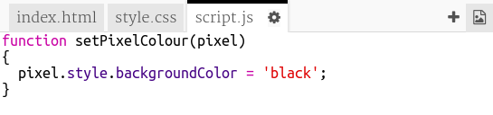

## पिक्सेल रंगवा

या प्रकल्पात तीन वेगवेगळ्या भाषेचा वापर करणार आहोत:

+ तुमचा मजकूर व्यवस्थित मांडण्यासाठी HTML वापराल
+ तुमचा मजकूर style सोबत कसा दिसेल हे CSS सांगेल
+ JavaScript ही एक प्रोग्रामिंग भाषा आहे, जेव्हा तुम्ही वेबपेजशी संवाद साधाल तेव्हा प्रतिसाद देण्यासाठी तुम्ही या भाषेचा वापर करू शकता

क्लिक केल्यावर पिक्सेल ला आपोआप रंग देण्यासाठी JavaScript code जोडा.

आपण **function** (फंक्शन) तयार करू. फंक्शन्सना कोड ब्लॉक्स असे नाव दिले जाते जे विशेष काम करतात. तुम्ही फंक्शन **call** (कॉल) करू शकता जेव्हा तुम्हाला त्यात असलेला कोड चालवायचा असेल.

+ `script.js` file मधे `setPixelColour` हे फंक्शन तयार करा. पिक्सेलचा रंग बदलण्यासाठी `setPixelColour` या फंक्शनमधून `pixel` हे **input** घ्यायचे आहे.

+ पिक्सेलचा बॅकग्राउंड रंग सेट करण्यासाठी फंक्शनमध्ये हा कोड जोडा:

लक्षात घ्या `backgroundColor` हे 'colour' चे अमेरिकन शब्दलेखन वापरते.

याक्षणी या कोडचा कोणताही परिणाम होणार नाही.

+ `index.html` वर जा आणि खालील कोड पिक्सेल मध्ये जोडा जेव्हा तुम्ही पिक्सेलवर क्लिक कराल तेव्हा `setPixelColour` फंक्शन बोलावले जाईल:

`this` या कंसात `setPixelColour` फंक्शनचे इनपुट आहे, ज्यामुळे - `this` या पिक्सेलचा रंग निश्चित करण्यासाठीची माहिती मिळते!

+ पहिल्या पिक्सेलवर क्लिक करून कोडची चाचणी करा. ते black झाले पाहिजे.

तुम्ही केवळ `onclick` कोड **first** पिक्सेलला जोडले आहे म्हणून इतर पिक्सेलवर क्लिक केल्यावर काहीही होणार नाही.