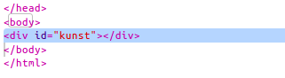
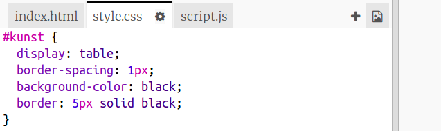
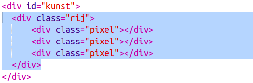
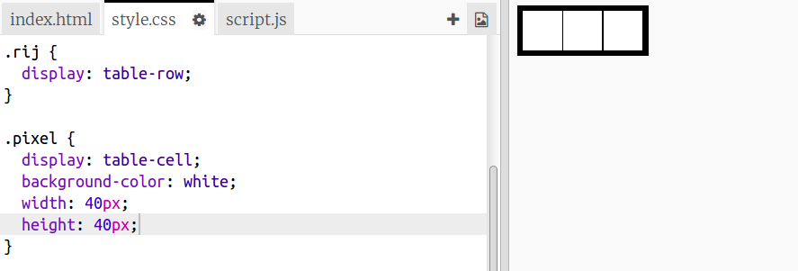
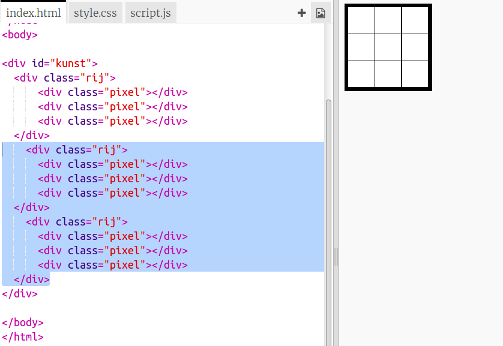

## Maak een raster van pixels

Laten we een raster van pixels maken dat je kunt gebruiken voor het maken van pixelkunst.

Het raster ziet eruit als een tabel. Tabellen bevatten rijen en rijen bevatten cellen die de pixels voorstellen.

+ Open de [start trinket](http://jumpto.cc/web-pixel).

Het project zou er als volgt uit moeten zien:

Laten we eerst een code schrijven om een ​​tabel met een zwarte achtergrond te maken om er vervolgens witte pixels in te plaatsen.

+ Voeg deze code toe aan de `<body>` van je `index.html` bestand om een ​​ `
` aan te maken:

Een `
` is een onzichtbare doos (Engels: box) die je een **stijl** (Engels: style) kunt geven. Deze `
` heeft de ID `kunst`, die je nodig hebt om een stijl (opmaak) aan de box te kunnen toevoegen.

+ Ga nu naar je `style.css` bestand en voeg de tabelstijl toe voor de `
` genaamd `kunst`.

Hiermee maak je een tabel met een rand en geef je de afstanden in het raster.

Het ziet er nog niet erg interessant uit, dus moet je er rijen pixels in plaatsen.

+ Ga terug naar je `index.html` bestand en voeg een rij van drie pixels **in** de box `kunst` toe. Als je tijd wilt besparen, typ je de eerste rij en kopieer en plak je deze in de andere rijen.

Merk op dat je hier een **class** gebruikt in plaats van een ID om de div's te stijlen. Dit komt omdat er veel van zullen zijn, dus een class is nuttiger.

+ Schakel over naar het `style.css` bestand en voeg de volgende stijlen toe voor de rijen en de pixels binnen elke rij:

Nu zullen je pixels in een raster worden geplaatst met zwarte lijnen eromheen.

+ Voeg in je `index.html` -bestand nog twee secties pixels toe om een ​​raster van 3 × 3 pixels te maken. Je kunt opnieuw kopiëren en plakken om tijd te besparen.

\--- hints \---

\--- hint \---

Find the `
` tag with the class `row` and copy it, including the three rows labelled `pixel` which are inside it, up to and including its matching `
` tag.

Paste this code immediately below the section you just copied to create another row. Repeat once more so that you have three rows of three pixels each.

You can check whether your table looks right by looking at the result area on the right.

\--- /hint \---

\--- hint \---

Here is how your code should look:

\--- /hint \---

\--- /hints \---