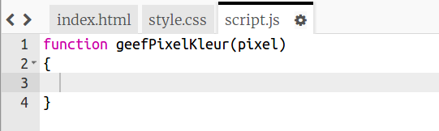
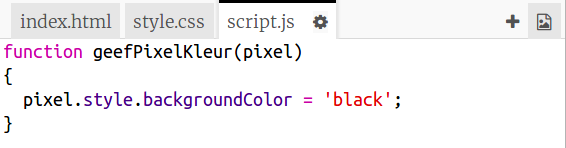
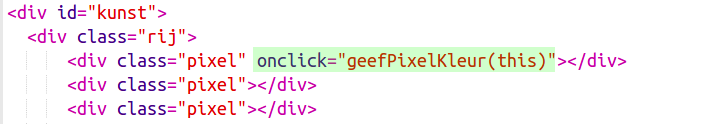

## Kleur de pixels

Dit project gebruikt drie verschillende talen:

+ HTML wordt gebruikt om de inhoud te ordenen
+ CSS vertelt hoe de inhoud met behulp van stijlen eruit gaat zien
+ JavaScript is een programmeertaal die je kunt gebruiken om een ​​webpagina te laten reageren wanneer je ermee communiceert

Laten we een JavaScript-code toevoegen om een pixel automatisch te kleuren als je erop klikt.

We gaan een **functie** maken. Functies zijn codeblokken met een naam die een specifieke taak uitvoeren. We kunnen een functie met zijn naam **aanroepen** als we de code die het bevat willen uitvoeren.

+ Maak binnen het `script.js` bestand een functie met de naam `setPixelColour`(geefPixelKleur). De functie `setPixelColour` moet een `pixel` als een **invoer** (Engels: input) aannemen, zodat deze de kleur van die pixel kan veranderen.

+ Voeg deze code toe aan de functie om de achtergrondkleur van de pixel in te stellen:

Merk op dat `backgroundColor` de Amerikaanse spelling van 'colour (kleur)' ​​gebruikt.

Op dit moment heeft deze code geen effect.

+ Ga naar `index.html` en voeg de volgende code aan de eerste pixel toe, zodat wanneer je op deze pixel klikt, de functie `setPixelColour` wordt aangeroepen:

De `this`(deze) tussen haakjes is de invoer voor de functie `setPixelColou`, die het laat weten welke pixel de kleur moet instellen voor - `deze` pixel!

+ Test je code door op de eerste pixel te klikken. Deze moet zwart worden.

Je hebt de `onclick` code alleen toegevoegd aan de **eerste** pixel, dus klikken op de andere pixels zal nog niets doen.