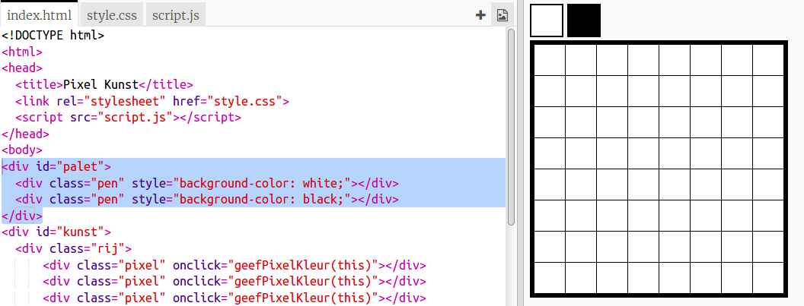
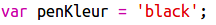
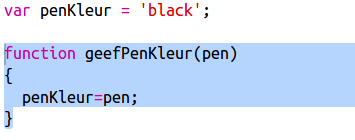
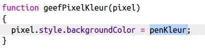
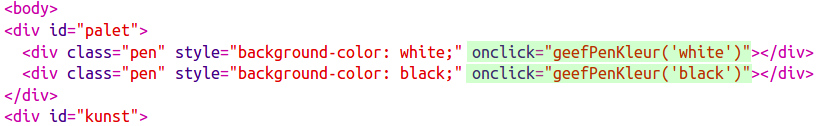

## Voeg een kleurenpalet toe

Vond je het vervelend dat je de kleur van een pixel niet in wit kon veranderen als je een fout maakte? Laten we dit oplossen door een kleurenpalet te maken, zodat je met een klik kunt kiezen tussen penkleuren.

+ Voeg deze code onder aan je `style.css` bestand toe om een ​​penstijl te maken:

+ Maak nu een palet met zwart-witte penkleuren met de penstijl die je zojuist hebt gemaakt. Voeg de volgende code toe aan je `index.html` onder de `<body>` tag:

`style =` stelt je in staat om CSS-code toe te voegen in je HTML-bestand, wat hier handig is.

We moeten code toevoegen zodat wanneer een van de kleuren in het palet wordt aangeklikt, de kleur van de pen verandert.

+ Schakel over naar `script.js` en maak een variabele met de naam `penKleur` helemaal bovenaan het bestand. Stel de waarde van de variabele in op `'black'`.

[[[generic-javascript-create-variable]]]

\--- hints \--- \--- hint \--- Voeg de volgende code bovenaan het bestand toe:

 \--- /hint \--- \--- /hints \---

+ Maak onder de variabele een nieuwe functie met de naam `geefPenKleur` met een invoer `pen`. Kijk naar de functie `geefPixelKleur` die je al hebt gemaakt om je te helpen.

[[[generic-javascript-create-a-function]]]

+ In de functie` geefPenKleur` voeg je code toe om de `penKleur` -variabele in te stellen op de `pen` kleur die als invoer wordt opgegeven.

You'll also need to use the `penColour` variable when you change the colour of a pixel.

+ Wijzig de functie `geefPixelKleur` om de `penKleur` -variabele te gebruiken in plaats van `black`:
    
    

+ Voeg in het `index.html` bestand een code toe om de functie `geefPenKleur` aan te roepen wanneer op een kleur in het palet wordt geklikt.

+ Test nu dat je de penkleur kunt wisselen tussen zwart en wit om pixels in te vullen of te verwijderen.