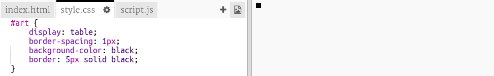

## Utwórz siatkę pikseli

Stwórzmy siatkę pikseli, której możesz użyć do tworzenia sztuki pikseli.

Siatka będzie wyglądać jak stół. Tabele zawierają wiersze, a wiersze zawierają komórki, które będą reprezentować piksele.

+ Open the [starter trinket](http://jumpto.cc/web-pixel).

Projekt powinien wyglądać następująco:

Najpierw napiszmy kod, aby utworzyć tabelę z czarnym tłem, a następnie wstawić do niej białe piksele.

+ Dodaj ten kod do `<body>` pliku `index.html` , aby utworzyć `
`:

A `
` is an invisible box to which you can give a **style**. Ten `
` ma identyfikator `art`, który jest potrzebny, aby można było dodawać style do tego pola.

+ Teraz przejdź do pliku `style.css` i dodaj stylizację tabeli dla `
` o nazwie `art`.

Tworzy to tabelę z ramką i ustawia odstępy wewnątrz siatki.

Nie wygląda jeszcze zbyt interesująco, więc musisz umieścić w nim rzędy pikseli.

+ Wróć do pliku `index.html` i dodaj wiersz z trzema pikselami **w polu** w polu `art`. Jeśli chcesz zaoszczędzić czas, możesz wpisać pierwszy wiersz, a następnie skopiować i wkleić go, aby utworzyć pozostałe.

Zauważ, że używasz **klasy** zamiast identyfikatora do stylu elementów div. Jest tak, ponieważ będzie ich wiele, więc klasa jest bardziej przydatna.

+ Przejdź do pliku `style.css` i dodaj następujące style dla wierszy i pikseli w każdym wierszu:

Teraz twoje piksele ustawią się w siatce z czarnymi liniami wokół nich.

+ W pliku `index.html` dodaj kolejne dwie sekcje pikseli, aby utworzyć siatkę o wymiarach 3 × 3 pikseli. Możesz ponownie skopiować i wkleić, aby zaoszczędzić czas.

\--- wskazówki \--- \--- podpowiedź \--- Znajdź `
` znacznik z klasy `wiersz` i skopiuj go, w tym trzy wiersze oznaczone jako `piksel` , które są w nim, aż do jego dopasowania `włącznie
` tag.

Wklej ten kod bezpośrednio pod sekcją, którą właśnie skopiowałeś, aby utworzyć kolejny wiersz. Powtórz jeszcze raz, aby mieć trzy rzędy po trzy piksele.

Możesz sprawdzić, czy Twój stół wygląda prawidłowo, patrząc na obszar wyników po prawej stronie. \--- / hint \--- \--- hint \--- Oto jak powinien wyglądać twój kod:

 \--- /hint \--- \--- /hints \---