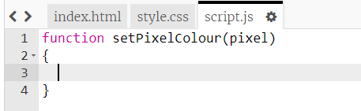

## Pokoloruj piksele

Ten projekt wykorzystuje trzy różne języki:

+ HTML służy do porządkowania treści
+ CSS mówi zawartość, jak wyglądać ze stylami
+ JavaScript to język programowania, którego można użyć, aby strona internetowa reagowała podczas interakcji z nią

Dodajmy trochę kodu JavaScript, aby pokolorować piksel automatycznie po kliknięciu.

Stworzymy **funkcję**. Funkcje to bloki kodu, które wykonują określone zadanie. Możemy **wywoływać** funkcję używając jej nazwy, gdy chcemy uruchomić kod, który zawiera.

+ Wewnątrz pliku `script.js` utwórz funkcję o nazwie `setPixelColour`. Funkcja `setPixelColour` musi przyjąć `piksel` jako **wejście**, aby mogła zmienić kolor tego piksela.

+ Dodaj ten kod wewnątrz funkcji, aby ustawić kolor tła piksela:

Zauważ, że `backgroundColor` używa amerykańskiej pisowni słowa "colour".

W tej chwili ten kod nie ma żadnego efektu.

+ Przejdź do `index.html` i dodaj następujący kod do pierwszego piksela, aby po kliknięciu tego piksela została wywołana funkcja `setPixelColour`:

`this` (z ang. ten) w nawiasach jest wejściem dla funkcji `setPixelColour`, który pozwala jej określić, który piksel ma ustawić kolor dla - `this` piksel!

+ Przetestuj swój kod, klikając na pierwszy piksel. Powinien stać się czarny.

Dodałeś kod `onclick` tylko do **pierwszego** piksela, więc kliknięcie innych pikseli nic jeszcze nie zrobi.