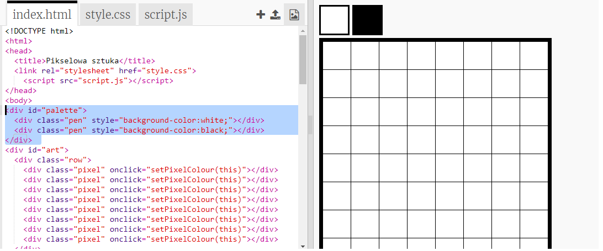

## Dodaj paletę kolorów

Czy denerwuje Cię to, że nie możesz zmienić koloru piksela z powrotem na biały, jeśli popełnisz błąd? Naprawmy to, tworząc paletę kolorów, aby można było wybierać między kolorami pióra za pomocą kliknięcia.

+ Dodaj ten kod u dołu pliku `style.css` , aby utworzyć styl pióra:

+ Teraz utwórz paletę z czarnymi i białymi kolorami pióra, używając właśnie utworzonego stylu pióra. Dodaj następujący kod do `index.html` poniżej tagu `<body>`:

`style=` umożliwia dodanie kodu CSS do pliku HTML, co jest tutaj wygodne.

Musimy dodać kod, aby po kliknięciu jednego z kolorów w palecie zmieniał się kolor pióra.

+ Przejdź do pliku `script.js` i utwórz zmienną o nazwie `penColour` na samej górze pliku. Ustaw wartość zmiennej na `"black"`.

[[[generic-javascript-create-variable]]]

\--- hints \--- \--- hint \--- Dodaj następujący kod u góry pliku:

 \--- /hint \--- \--- /hints \---

+ Poniżej zmiennej, utwórz nową funkcję o nazwie `setPenColour` z wejściem `pen`. Spójrz na funkcję `setPixelColour`, którą już utworzyłeś, aby ci pomóc.

[[[generic-javascript-create-a-function]]]

+ Wewnątrz funkcji `setPenColour` dodaj kod, aby ustawić zmienną `penColour` na kolor `pen` podany jako wejście.

Będziesz także musiał użyć zmiennej `penColour` do zmiany koloru piksela.

+ Zmień funkcję `setPixelColour`, aby używała zmiennej `penColour` zamiast `black`:
    
    

+ W pliku `index.html` dodaj kod do wywołania funkcji `setPenColour` po kliknięciu koloru w palecie.

+ Sprawdź, czy możesz zmienić kolor pióra między czarnym i białym, aby wypełnić lub usunąć piksele.