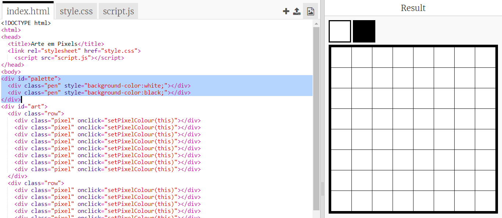

## Adicione uma paleta de cores

Você achou ruim não poder mudar a cor de um pixel de volta ao branco se cometeu um erro? Vamos consertar isso criando uma paleta de cores para que você possa escolher as cores da caneta com um clique.

+ Adicione este código na parte inferior do seu arquivo ` style.css ` para criar um estilo de caneta:

+ Agora crie uma paleta com cores de caneta preta e branca usando o estilo de caneta que você acabou de criar. Adicione o seguinte código ao seu ` index.html` abaixo do tag `<body>`:

`style =` permite que você adicione o código CSS dentro de seu arquivo HTML, o que é conveniente aqui.

Precisamos adicionar um código para que, quando uma das cores da paleta for clicada, a cor da caneta seja alterada.

+ Alterne para o `js` e crie uma variável chamada `penColour` (cor da caneta) no topo do arquivo. Defina o valor da variável de `'black'` (preto).

[[[generic-javascript-create-variable]]]

\--- hint \---:

 \--- /hint \--- \--- /hints \---

+ Abaixo da variável, crie uma nova função chamada ` setPenColour ` com uma ` pen` (caneta) como entrada. Veja a função ` setPixelColour ` que você já criou para ajudá-lo.

[[[generic-javascript-create-a-function]]]

+ Dentro da função `setPenColour`, adicione código para definir a variável `penColour` como a cor da `pen` (caneta) dada como entrada.

Você vai precisar também usar a variável de `penColour` quando você mudar a cor de um pixel.

+ Altere a função ` setPixelColour ` para usar a variável ` penColour ` em vez de ` black ` (a cor preta):
    
    

+ No arquivo` index.html `, adicione o código necessário para chamar a função ` setPenColour ` quando uma cor na paleta for clicada.

+ Teste se você pode alternar a cor da caneta entre preto e branco para preencher ou excluir pixels.