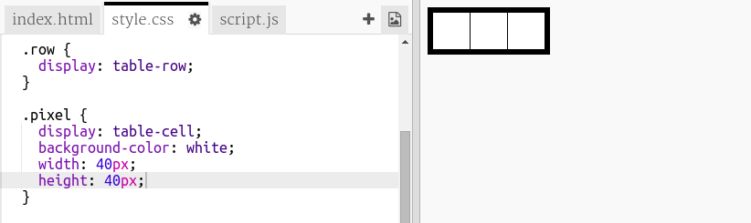

## Criar uma grelha de pixels

Vamos criar uma grelha de pixeis que poderás usar para criar arte em pixels.

A grelha irá parecer uma tabela. As tabelas contêm linhas, e as linhas contêm células que representam os pixeis.

+ Abre o [trinket inicial](http://jumpto.cc/web-pixel).

O projeto deverá parecer-se com isto:

Primeiro, vamos escrever código para criar uma tabela com fundo preto e depois colocar pixeis brancos nela.

+ Adiciona este código ao `<body>` do teu ficheiro `index.html` para criar um `
`:

O `
` é uma caixa invisível à qual podes dar um **estilo**. Este `
` tem o ID ` art `, que tu precisas para adicionar estilos à caixa.

+ Agora vai para o teu ficheiro `estilos.css` e adiciona o estilo da tabela para o `
`chamado `arte`.

Isto cria uma tabela com uma borda e define o espaçamento dentro da grelha.

Ainda não parece muito interessante, por isso precisas de colocar linhas de pixeis dentro dela.

+ Volta para o teu ficheiro ` index.html ` e adiciona uma linha de três pixeis ** dentro ** da caixa de ` arte `. Se quiseres poupar tempo, podes escrever a primeira linha e, em seguida, copiar e colar para criar as outras.

Observa que aqui estás a usar **class** em vez de ID para estilizar os divs. Isso é porque haverá muitos e por isso uma classe é mais útil.

+ Alterna para o ` estilos.css ` e adiciona os seguintes estilos para as linhas e os pixeis em cada linha:

Agora os teus pixels serão alinhados numa grelha com linhas pretas em redor deles.

+ No teu ficheiro ` index.html `, adiciona outras duas seções de pixeis para criar uma grelha de 3 × 3 pixeis. Podes copiar e colar novamente para poupar tempo.

\--- hints \---

\--- hint \---

Encontra a tag `
` com a classe `row ` e copia-a, incluindo as três linhas chamadas ` pixel ` que estão dentro dela, até e incluindo a correspondente ` 
` tag.

Cola este código imediatamente abaixo da seção que acabaste de copiar para criar outra linha. Repete mais uma vez para ter três linhas de três pixeis cada.

Podes verificar se a tua tabela está correta, olhando para a área de resultados à direita.

\--- /hint \---

\--- hint \---

Este é o aspeto que o teu código deve ter:

\--- /hint \---

\--- /hints \---