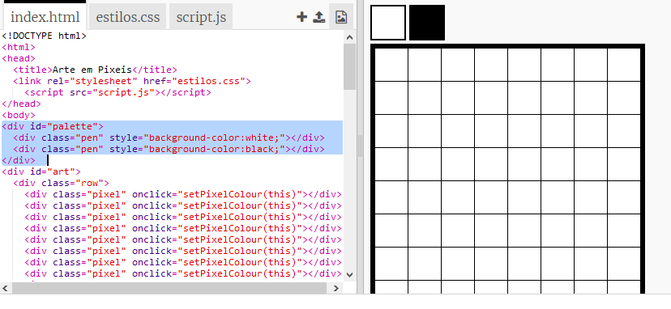

## Adicionar uma paleta de cores

Achaste irritante não poder mudar a cor de um pixel de volta para branco se cometeres um erro? Vamos corrigir isso criando uma paleta de cores para que possas escolher entre as cores da caneta com um clique.

+ Adiciona este código na parte inferior do teu ficheiro `estilos.css` para criar um estilo de caneta:

+ Agora cria uma paleta com cores da caneta em preto e branco usando o estilo de caneta que acabaste de criar. Adiciona o seguinte código ao teu `index.html` abaixo da tag `<body>`:

`style =` permite adicionar código CSS ao teu ficheiro HTML, o que é conveniente aqui.

Precisamos adicionar código para que, ao clicar em uma das cores da paleta, a cor da caneta mude.

+ Alterna para `script.js` e cria uma variável chamada `penColour` no topo do ficheiro. Define o valor da variável como ` 'black' ` (preto).

[[[generic-javascript-create-variable]]]

--- hints ---

--- hint ---

Adiciona o seguinte código no topo do ficheiro:

--- /hint ---

--- /hints ---

+ Abaixo da variável, cria uma nova função chamada `setPenColour` com uma entrada de `caneta`. Vê a função `setPixelColour` que já criaste para te ajudar.

[[[generic-javascript-create-a-function]]]

+ Dentro da função `setPenColour`, adiciona o código para definir a variável ` penColour` para a cor da `caneta ` fornecida como entrada.

Irás também precisar de usar a variável `penColour` quando alterares a cor de um pixel.

+ Altera a função `setPixelColour` para usar a variável `penColour` em vez de `black` (preto):
    
    

+ No ficheiro `index.html`, adiciona algum código para chamar a função `setPenColour` quando uma cor na paleta é clicada.

+ Testa se consegues alternar a cor da caneta entre preto e branco para preencher ou apagar pixeis.