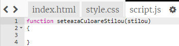
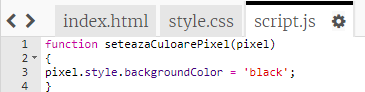
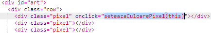

## Colorează pixelii

Proiectul folosește trei limbi diferite:

+ HTML este folosit pentru a-ți organiza conținutul
+ CSS spune conținutului cum ar trebui să arate stilizat
+ JavaScript este un limbaj de programare pe care îl poți folosi pentru ca o pagină web să răspundă atunci când interacționezi cu ea

Hai să adăugăm niște cod JavaScript pentru a color un pixel automat când se dă click pe el.

Vom crea o **funcție**. Funcțiile sunt blocuri de cod denumite care îndeplinesc o anumită sarcină. Putem să **apelăm** o funcție cu numele ei atunci când vrem să executăm codul pe care o conține.

+ În interiorul fișierului `script.js`, creează o funcție cu numele `seteazaCuloarePixel`. Funcția `seteazaCuloarePixel` trebuie să primească un `pixel` ca și o **intrare** pentru a putea schimba culoarea pixelului.

+ Adaugă acest cod în interiorul funcției pentru a seta culoarea fundalului pentru un pixel:

Observă că `backgroundColor` folosește ortografia americană pentru cuvântul „colour”.

Momentan, codul nu are niciun efect.

+ Mergi la fișierul `index.html` și adaugă următorul cod pentru primul pixel astfel încât acesta să apeleze funcția `seteazaCuloarePixel` atunci când se dă click pe el:

Cuvântul `this` în paranteze este intrarea pentru funcția `seteazaCuloarePixel` care îi permite să știe care dintre pixeli să fie colorat — `this` (acest) pixel!

+ Testează-ți codul dând click pe primul pixel. Ar trebui să devină negru.

Ai adăugat codul `onclick` doar la **primul** pixel, așa că dacă dai click pe ceilalți pixeli nu se va întâmpla nimic momentan.