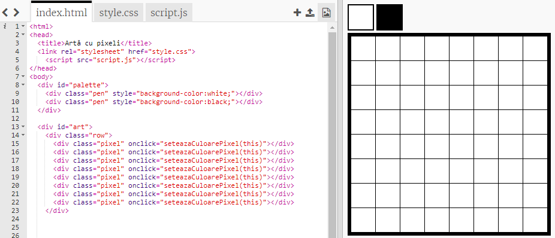
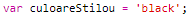
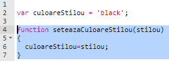
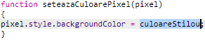
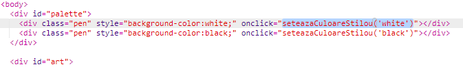

## Adaugă o paletă de culori

Ți s-a părut enervant că nu poți să schimbi culoarea unui pixel în alb dacă ai greșit? Hai să rezolvăm asta creând o paletă de culori pentru a putea alege între mai multe culori cu un click.

+ Adaugă acest cod în partea de jos a fișierului tău `style.css` pentru a crea un stil de stilou:

+ Acum, creează o paletă cu creioane negre și albe folosind stilul stiloului pe care tocmai l-ai creat. Adaugă următorul cod la fișierul `index.html`, sub eticheta `<body>`:

`style=` permite adăugarea de cod CSS în interiorul fișierului tău HTML, lucru convenabil aici.

Trebuie să adăugăm niște cod pentru ca culoarea stiloului să se schimbe atunci când se dă click pe una dintre culorile din paletă.

+ Comută la fișierul `script.js` și creează o variabilă create `culoareStilou` la începutul fișierului. Setează valoarea variabilei la `'black'`.

[[[generic-javascript-create-variable]]]

\--- hints \--- \--- hint \--- Adaugă următorul cod în partea de sus a fișierului:

 \--- /hint \--- \--- /hints \---

+ Sub variabilă, creează o nouă funcție numită `seteazaCuloareStilou` cu intrarea `stilou`. Uită-te la funcția `seteazaCuloarePixel` pe care ai creat-o deja pentru a te ajuta.

[[[generic-javascript-create-a-function]]]

+ În interiorul funcției `seteazaCuloareStilou`, adaugă cod pentru a seta variabila `culoareStilou` la culoarea `stilou` furnizată ca intrare.

You'll also need to use the `penColour` variable when you change the colour of a pixel.

+ Modifică funcția `seteazaCuloarePixel` pentru a folosi variabila `culoareStilou` în loc de `black`:
    
    

+ În fișierul `index.html`, adaugă niște cod pentru a apela funcția `seteazaCuloareStilou` atunci când se dă click pe o culoare din paletă.

+ Testează dacă poți schimba culoarea stiloului între negru și alb pentru a umple sau șterge pixeli.