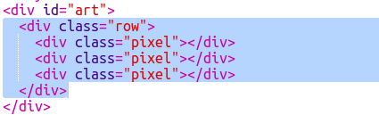

## Создадим сетку из пикселей

Создадим секту из пикселей, которую мы будем использовать для пиксельной графики.

Сетка выглядит как таблица. Таблица содержит строки, строки содержат ячейки, которые будут представлять пиксели.

+ Откройте [начальную заготовку](http://jumpto.cc/web-pixel).

Проект должен выглядеть следующим образом:

Сначала напишем некоторый код для создания таблицы с черным фоном, а затем поместим в нее белые пиксели.

+ Добавьте этот код в `<body>` вашего файла ` index.html` чтобы создать `
`:

`
` - это невидимое поле, которому вы можете присвоить **стиль**. Этот `
` имеет идентификатор ` art `, так чтобы вы могли добавить стили в поле.

+ Теперь перейдите в файл `style.css` и добавьте стиль таблицы для `
` с названием `art`.

Это создает таблицу с рамкой и задает интервал внутри сетки.

Чтобы сделать таблицу более интересной, давайте добавим в неё пиксели.

+ Вернитесь к `index.html` файлу и добавьте ряд с тремя пикселями **внутри** поля `art`. Вы можете сделать это быстрее, если введете только первую строку, а затем скопируете и вставите её несколько раз, чтобы создать остальные строки.

Обратите внимание, что вы используете **class** вместо id для стилизации поля div. Так как будет использовано несколько div, использование class позволит им иметь общий стиль.

+ Переключитесь на `style.css` и добавьте следующие стили для строк и пикселей в каждой строке:

Теперь ваши пиксели выстроятся в сетку с черными линиями вокруг них.

+ В вашем `index.html` файл, добавьте еще два раздела пикселей, чтобы создать сетку пикселей 3 × 3. Вы можете использовать копирование и вставку снова, чтобы сэкономить время.

\--- hints \---

\--- hint \---

Find the `
` tag with the class `row` and copy it, including the three rows labelled `pixel` which are inside it, up to and including its matching `
` tag.

Paste this code immediately below the section you just copied to create another row. Repeat once more so that you have three rows of three pixels each.

You can check whether your table looks right by looking at the result area on the right.

\--- /hint \---

\--- hint \---

Here is how your code should look:

\--- /hint \---

\--- /hints \---