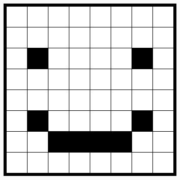

\--- challenge \---

## Задача: сделать все пиксели нажимаемыми

Можешь ли ты сделать все пиксели нажимаемыми? Чтобы сэкономить время, ты можешь скопировать и вставить нужный код.

Протестируй свой код, создав быстрый набросок пиксельной графики.

Совет: ты можешь нажать **Autorun** для очистки всех пикселей.

\--- /challenge \---