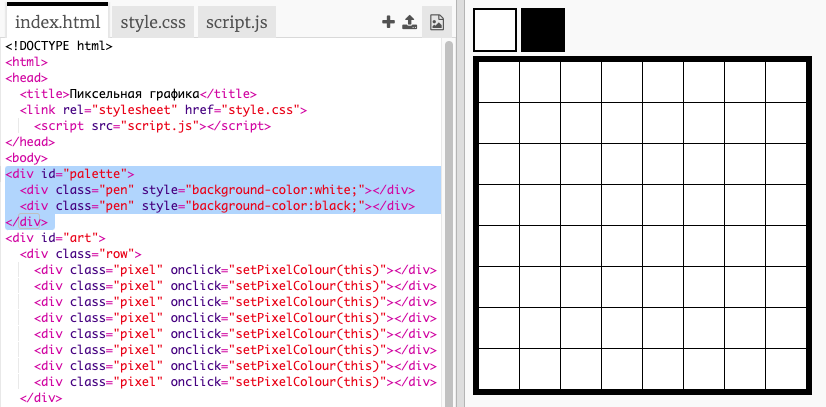
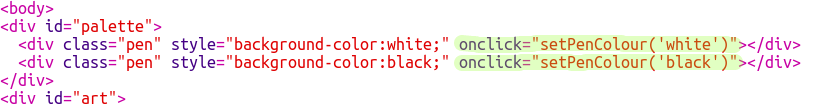

## Добавим цветовую палитру

Тебя раздражает, что ты не можешь изменить цвет пикселя обратно на белый, если ты совершил ошибку? Давай это исправим, создав цветовую палитру, чтобы ты мог выбирать между цветами пера.

+ Добавь этот код внизу твоего `style.css`, чтобы создать стиль пера:

+ Теперь создай палитру с чёрным и белым цветом пера, используя стиль пера, который ты только что создал. Добавь этот код в твой `index.html` внизу тега `<body>`:

`style=` позволяет добавлять код CSS внутри файла HTML, что удобно в данном случае.

Нам надо добавить код, чтобы когда один из цветов в палитре нажат, цвет пера изменялся.

+ Переключись на `script.js` и создай переменную под названием `penColour` в самом верху файла. Установи значение переменной на `'black'`.

[[[generic-javascript-create-variable]]]

--- hints ---

--- hint ---

Добавь следующий код вверху файла:

--- /hint ---

--- /hints ---

+ Ниже переменной, создай новую функцию под названием `setPenColour` с параметром `pen`. Посмотри на функцию `setPixelColour`, которую ты уже создал — это тебе поможет.

[[[generic-javascript-create-a-function]]]

+ Внутри функции `setPenColour`, добавь код, чтобы установить переменную `penColour` на значение цвета `pen`, указанного в качестве параметра.

Тебе также нужно использовать переменную `penColour`, когда ты меняешь цвет пикселя.

+ Измени функцию `setPixelColour` для использования переменной `penColour` вместо `black`:
    
    

+ В `index.html` добавь немного кода, чтобы вызвать функцию `setPenColour`, когда цвет в палитре нажат.

+ Убедись, что ты можешь переключать цвет пера между белым и чёрным, чтобы заполнить или удалить пиксели.