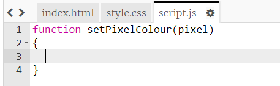

## Додай пікселям колір

Цей проєкт використовує три різні мови:

+ HTML використовується для упорядкування вмісту
+ CSS задає, як вміст виглядатиме за допомогою стилів
+ JavaScript — це мова програмування, за допомогою якої можна зробити так, щоб вебсторінка реагувала, коли ти з нею взаємодієш

Давай додамо деякий код JavaScript, щоб зафарбовувати пікселі автоматично, коли ти натискаєш на них.

Ми створимо **функцію** . Функції — це поіменовані блоки коду, які виконують певне завдання. Ми можемо **викликати** функцію за її назвою, коли ми хочемо запустити код, який вона містить.

+ Всередині файла `script.js`, створи функцію з назвою `setPixelColour`. Функція `setPixelColour` має прийняти `pixel` як **вхідний параментр** щоб змінити колір цього пікселя.

+ Додай цей код усередину функції, щоб задати колір фону пікселя:

Зверни увагу, що `backgroundColor` використовує американський правопис слова "колір".

На даний момент цей код не має жодного ефекту.

+ Перейди до `index.html` і додай наступний код до першого пікселя, щоб при натисканні на нього викликалася функція `setPixelColour`:

`this` в дужках — вхідний параметр для функції `setPixelColour`, який дає змогу їй дізнатись, у якому пікселі треба встановити колір — в цьому (this) пікселі!

+ Перевірте свій код, натиснувши на перший піксель. Він має стати чорним.

Ви тільки додали код `onclick` тільки до **першого** пікселя, тому натискання на інші пікселі поки що нічого не змінить.