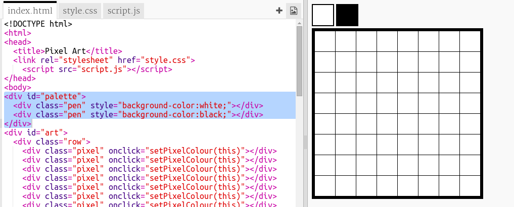

## Додайте кольорову палітру

Вас дратує те, що ви не можете змінити колір пікселя на білий, якщо ви зробили помилку? Визначимо це, створивши колірну палітру, щоб ви могли вибрати один з кольорів за допомогою кліку.

+ Додайте цей код у нижній частині вашого `style.css` файл для створення стилю ручки:

+ Тепер створіть палітру з чорно-білими кольорами, використовуючи створений вами стиль пера. Додайте наступний код до `index.html` нижче `<body>` тег:

`style =` дозволяє додавати код CSS у ваш HTML-файл, що зручно тут.

Нам потрібно додати код так, щоб при натисканні одного з кольорів на палітрі кольори пера змінювалися.

+ Перейдіть на ` script.js ` і створіть змінну з назвою ` penColour ` на самому верху файла. Встановити значення змінної до ` 'black' ` .

[[[generic-javascript-create-variable]]]

\--- hints \---

\--- hint \---

Add the following code at the top of the file:

\--- /hint \---

\--- /hints \---

+ Нижче змінної створіть нову функцію, яка називається `setPenColour` з входом `pen`. Подивіться на функцію `setPixelColour` що ви вже створили, це допоможе вам.

[[[generic-javascript-create-a-function]]]

+ Всередині `setPenColour` функція, додайте код, щоб встановити `penColour` змінна до `pen` колір наданий як вхідний.

You'll also need to use the `penColour` variable when you change the colour of a pixel.

+ Змініть ` setPixelColour ` Використовуйте ` penColour ` змінна замість `black` :
    
    

+ У `index.html` файл, додайте код, щоб натиснути `setPenColour ` Функція, коли натискається колір у палітрі.

+ Перевірте, чи можна змінити колір пера між чорним і білим, щоб заповнити або видалити пікселі.