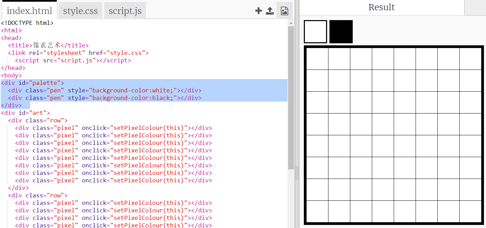

## 添加调色板

您是否因遇到这种情況而感到烦恼：一旦不小心点错，就无法将错误像素的颜色改回白色？ 让我们创建一个调色板来解决这个问题：您可以通过单击来更改画笔的颜色。

+ 将此代码添加到您的`style.css`文件底部，就可以创建画笔的样式：

+ 现在，使用刚才创建的画笔来创建具有黑白画笔颜色的调色板。在`index.html`文件中，将以下代码添加到`<body>`标签下面：

`style=`允许您在HTML文件中很方便地添加CSS代码。

我们需要添加代码，使得在用户单击调色板中的某一种颜色时，画笔的颜色会相应改变。

+ 切换到`script.js `文件。在文件的最顶部创建一个名为`penColour`的变量，并将变量的初始值设置为`'black'` 。

[[[generic-javascript-create-variable]]]

\--- hints \---

\--- hint \---

Add the following code at the top of the file:

\--- /hint \---

\--- /hints \---

+ 在变量下面，创建一个名为`setPenColour`的新函数，函数的输入是`pen` 。您可以参考您已经创建的函数`setPixelColour`获得帮助。

[[[generic-javascript-create-a-function]]]

+ 在` setPenColour`函数中，添加下述代码，将变量` penColour `设置为提供的输入 `pen`。

You'll also need to use the `penColour` variable when you change the colour of a pixel.

+ 将 `setPixelColour` 函数更改为使用`penColour` 变量而不是 `black`：
    
    

+ 在 `index.html` 文件中，添加一些代码使得当调色板中的颜色被点击时，可以调用`setPenColour`函数。

+ 测试您是否可以在黑色和白色之间切换笔的颜色用来填充或删除像素。