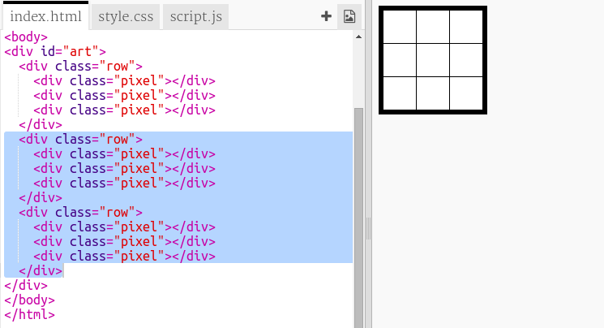

## 創建像素網格

讓我們創建一個可用於創建像素藝術的像素網格。

網格看起來像一張桌子。表包含行，行包含將表示像素的單元格。

+ 打開 [啟動小飾品](http://jumpto.cc/web-pixel)。

該項目應如下所示：

首先，讓我們編寫一些代碼來創建一個黑色背景的表格，然後將白色像素放入其中。

+ 將此代碼添加到 `index.html` 文件的 `<body>` 中以創建 `
`：

A `
` 是一個隱形框，你可以給它一個 **風格**。 這個 `
` 有你需要的ID `art`，所以你可以在盒子裡添加樣式。

+ 現在轉到你的 `style.css` 文件，並為名為 `art`的 `
` 添加表格樣式。

這將創建一個帶邊框的表格，並設置網格內的間距。

它看起來不是很有趣，所以你需要在其中放置像素行。

+ 回到你 `的index.html` 文件，並添加三個像素的行 **中** 的 `藝術` 盒。 如果要節省時間，可以鍵入第一行，然後復制並粘貼它以創建其他行。

請注意，在這裡，您使用 **類** 而不是ID來設置div的樣式。這是因為它們會有很多，所以一個類更有用。

+ 切換到 `style.css` 文件，並為每行中的行和像素添加以下樣式：

現在，您的像素將在網格中排成一行，周圍有黑線。

+ 在您的 `index.html` 文件中，添加另外兩個像素部分以創建3×3像素網格。您可以再次使用複制和粘貼來節省時間。

\--- hints \---

\--- hint \---

Find the `
` tag with the class `row` and copy it, including the three rows labelled `pixel` which are inside it, up to and including its matching `
` tag.

Paste this code immediately below the section you just copied to create another row. Repeat once more so that you have three rows of three pixels each.

You can check whether your table looks right by looking at the result area on the right.

\--- /hint \---

\--- hint \---

Here is how your code should look:

\--- /hint \---

\--- /hints \---