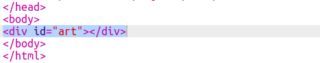

## 建立一個像素表格

我們來創建一個像素表格來建立像素藝術。

網格看起來像一張表格。表格中包含了行列，行列構成的單元格將用來代表像素。

+ 點閱 [starter trinket](http://jumpto.cc/web-pixel)。

此項目應該看起來像這樣：

首先，讓我們編寫一些程式碼來建立一個帶有黑色背景的表格，然後將白色像素放入其中。

+ 將此程式碼加入到你的`index.html` 文件的 `<body>` 中來創建 一個`
`：

`
` 是一個隱形框，你可以給它一個 **style**（樣式）。 這個 `
` 有一個ID `art`, 用來添加樣式。

+ 現在到你的 `style.css` 文件，並在名為 `art`的 `
` 添加表格樣式。

這建立了一個帶有邊框的表格，並調整表格內的距離。

它目前看起來還不是很有趣，因此你需要在其中放置像素列。

+ 回到你的 `的index.html` 文件，並添加三行像素的程式碼到`art `框**裡面**。 如果想節省時間，你可以只輸入第一行，然後在下一行複製並貼上一樣的程式碼。

請注意，你使用了 **class** 而不是ID來設定div的樣式。這是因為程序裡有很多ID，所以使用class會增加效率。

+ 切換到 `style.css` 文件，並為每行中的像素和格式添加以下樣式：

你的像素在表格中排成一行，周圍有黑線。

+ 在你的 `index.html` 文件中，添加另外兩個像素來建立一個3×3像素表格。你可以再次使用複製和貼上來節省時間。

\--- hints \---

\--- hint \---

找到帶有`row`類別的`
`標籤, 複製它, 並包含`pixel`標籤的三行程式碼和它相對應的&lt;/div&gt;<1>標籤。

將此程式碼貼上到剛才複製的部分來建立另一行。再重複一次，總共得到三行，每行三個像素。

你可以透過查看右側的結果區域來檢查你的表格是否正確。

--- /hint ---

--- hint ---

你的程式碼看起來應該像這樣：

--- /hint ---

--- /hints ---
