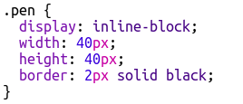

## 添加一個調色板

如果你犯了錯誤，你是否覺得難以將像素的顏色改回白色？ 讓我們透過建立一個調色板來解決這個問題，以便你可以透過點擊選擇不同筆刷顏色。

+ 將此程式碼新增到 `style.css` 檔案的底部以建立一個筆刷樣式：

+ 現在，使用剛建立的筆刷樣式創建一個黑白筆刷顏色的調色板。將以下程式碼添加到你的`index.html`的`<body>`標籤下方：

`style =` 允許你在HTML檔案中加入CSS程式碼，這在這裡非常方便。

我們需要新增程式碼，以便在點擊調色板中的一種顏色時，筆刷的顏色會跟著發生變化。

+ 切換到 `script.js` 並在檔案的最上方創建一個名為 `penColour` 的變數。該變數的值設置為 `'black'`。

[[[generic-javascript-create-variable]]]

\--- hints \---

\--- hint \---

在檔案最上方添加以下程式碼：

\--- /hint \---

\--- /hints \---

+ 查看你已建立的函數 `setPixelColour` 來幫助你在變數下面，建立一個名為 `setPenColour` 的新函數，其輸入為 `pen`。

[[[generic-javascript-create-a-function]]]

+ 在 `setPenColour` 函數內，添加程式碼以將 `penColour` 變數設置為作為提供輸入的 `pen` 顏色。

當你想要更改一個像素的顏色時，你將會需要使用 `penColour` 變數。

+ 更改 `setPixelColour` 函數來使用 `penColour` 變數而不是直接更改 `black`：
    
    

+ 在 `index.html` 文件中，新增一些程式碼，讓你在點擊調色板中的顏色時呼叫 `setPenColour` 函數。

+ 測試你是否可以在黑白之間切換筆刷顏色以填充或刪除像素。